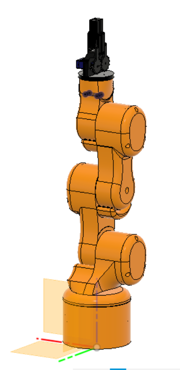
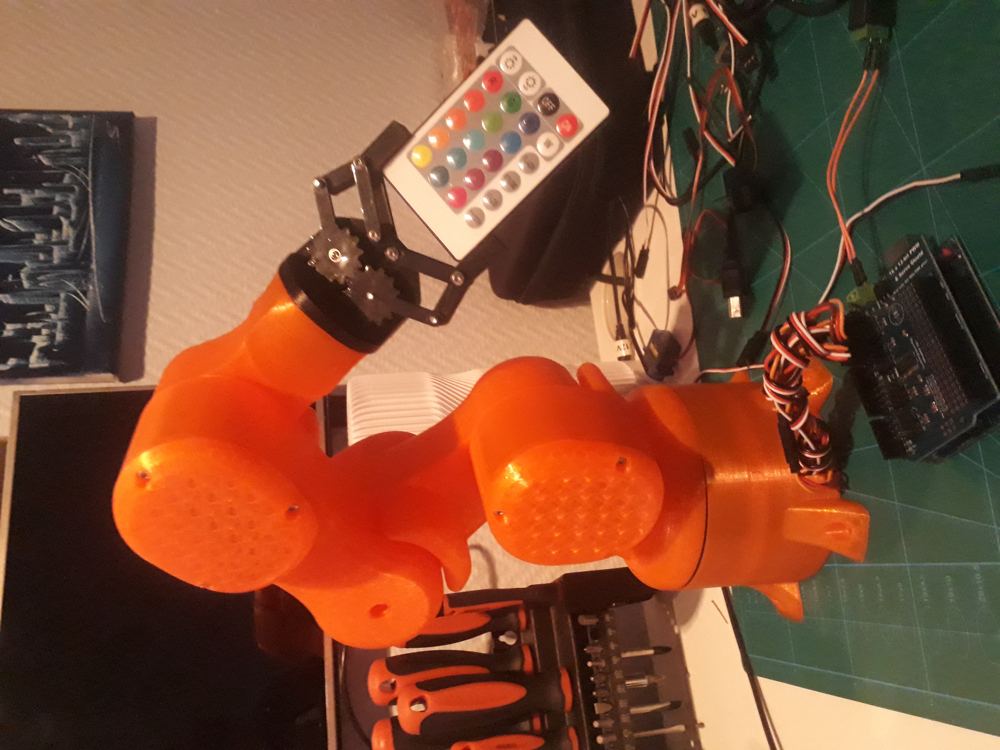

# simple-servo-robot-arm
A simple 5DOF robot arm made using servo motors, controlled by an Arduino Uno with a servo shield. Some potentiometers and a few buttons are used to control the robot.

Each joint can be controlled using a potentiometer. A series of positions for all of the joints can be saved and run on repeat.

Martin Ansteensen 2019
